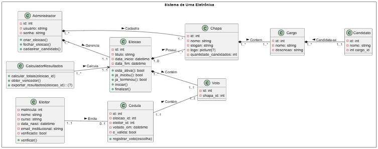
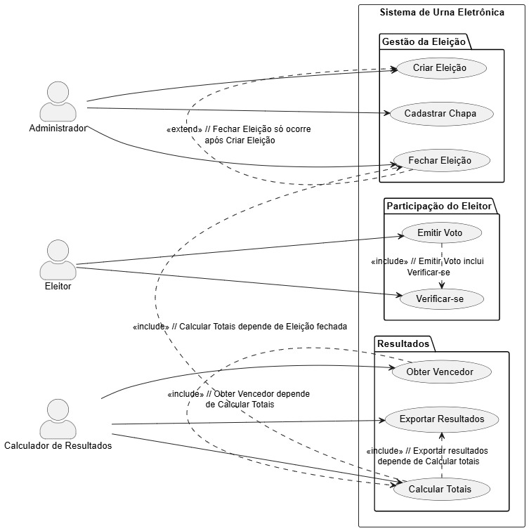

# Urna Eletrônica

Repositorio criado como complemento de andamento de projeto na disciplina de Tópicos Especiais em Sistemas de Informação, ministrado por [@mlimeira](https://github.com/mlimeira)
## Descrição:

### Problema
Dentro da Universidade Federal do Acre (UFAC), os processos de votação estudantil ainda enfrentam dificuldades que comprometem tanto a transparência quanto a praticidade. Em muitos casos, as eleições de representantes estudantis, como as do Centro Acadêmico acabam sendo realizadas de forma manual, com cédulas de papel ou "registros" pouco estruturados. Isso pode gerar problemas de organização, riscos de extravio de votos, demora na apuração e até questionamentos sobre a legitimidade do resultado. ~coisa que já acontece bastante dentro do meio político dentro da universidade~

Foi nesse contexto que nasceu a proposta do nosso projeto de Urna Eletrônica. O objetivo é desenvolver um sistema digital acessível, seguro e eficiente, que possa ser aplicado em eleições acadêmicas, facilitando a participação dos estudantes e garantindo maior confiabilidade e agilidade no processo.

A relevância desse projeto se torna ainda mais evidente pelo fato de dois integrantes da equipe serem membros ativos do Centro Acadêmico de Sistemas de Informação, o que nos dá uma visão direta dos desafios enfrentados na prática. Essa vivência nos motivou a buscar uma solução tecnológica que, além de servir como um projeto na disciplina de Tópicos Especiais em Sistemas de Informação(TESI), que utiliza o Tkinter como principal interface gráfica, também tenha impacto real dentro da comunidade universitária.

## UML:
### Diagrama de Classes:

Nosso diagrama de classes representa a estrutura básica do sistema de Urna Eletrônica.

A classe Eleição é o ponto central: nela ficam guardados os dados principais (id, título, data de início e fim) e os métodos que controlam o status, tipo `iniciar()` e `finalizar()`. É como o “container” que organiza tudo o que rola dentro de uma eleição.

A Chapa agrupa os candidatos. Ela tem atributos como nome, slogan, logo e quantidade de candidatos, funcionando como a identidade do grupo que disputa. **Uma chapa** contém *Cargos*, e cada cargo pode ter um *Candidato associado*, o que dá flexibilidade pra representar funções diferentes dentro da mesma chapa.

O **Eleitor** é quem participa da *eleição*. Ele tem dados de matrícula, curso, data de nascimento e e-mail institucional (pra validar que é realmente um aluno). O método `verificar()` é justamente pra checar se o eleitor pode ou não votar.

Quando o eleitor vota, ele gera uma *Cédula*. Essa classe como se fosse o comprovante interno da votação, com informações de quando o voto foi registrado e se ele é válido. A cédula guarda um *Voto*, e esse voto aponta direto pra uma *Chapa*, já que a escolha é por grupo e não por candidato individual.

A classe *Administrador* representa quem organiza a eleição: *cria eleições, cadastra chapas e candidatos e fecha o processo quando necessário*. Já o *CalculadorResultados* é a parte que faz a apuração: ele soma os votos, identifica o vencedor e permite exportar os resultados pra dar transparência.

No geral, esse diagrama mostra bem como cada parte do sistema se conecta: da criação da eleição, passando pelo cadastro das chapas, até o momento do eleitor votar e o sistema calcular o resultado. Tudo foi pensado pra ser simples, confiável e adaptado ao contexto das eleições acadêmicas.

### Diagrama de Caso de Uso:

O diagrama de casos de uso representa as funcionalidades principais do sistema de Urna Eletrônica e os atores que interagem com ele.

Na parte de **Gestão da Eleição**, o ator *Administrador* é responsável por _criar, cadastrar chapas e fechar eleições_. A relação entre os casos de uso mostra a ordem lógica do processo: só é possível fechar uma eleição depois que ela foi criada, e o cadastro de chapas ocorre nesse intervalo.

Na seção de **Participação do Eleitor**, o ator *Eleitor* precisa primeiro se verificar no sistema para validar seus dados institucionais. Esse passo é obrigatório, pois o caso de uso Emitir Voto inclui a verificação, garantindo que apenas eleitores autorizados possam participar.

Já em **Resultados**, o ator Calculador de Resultados entra em cena após o *encerramento da eleição*. Ele é responsável por calcular os totais de votos, obter o vencedor e exportar os resultados. As dependências deixam claro o fluxo: primeiro a eleição precisa estar fechada, depois os votos são contabilizados, e só então é possível divulgar o vencedor ou exportar os dados.

De forma geral, o diagrama organiza bem a lógica do sistema: do controle da eleição pelo administrador, passando pela participação do eleitor, até a etapa final de apuração e divulgação de resultados.
## Autores

- [Andrey Marques](https://www.github.com/Andrey-Marques)
- [Carlos Marin](https://www.github.com/CarlossEduu)
- [Gabriel Daniel](https://www.github.com/Bields190)
- [Khalil de Brito](https://www.github.com/khalildebrito)

